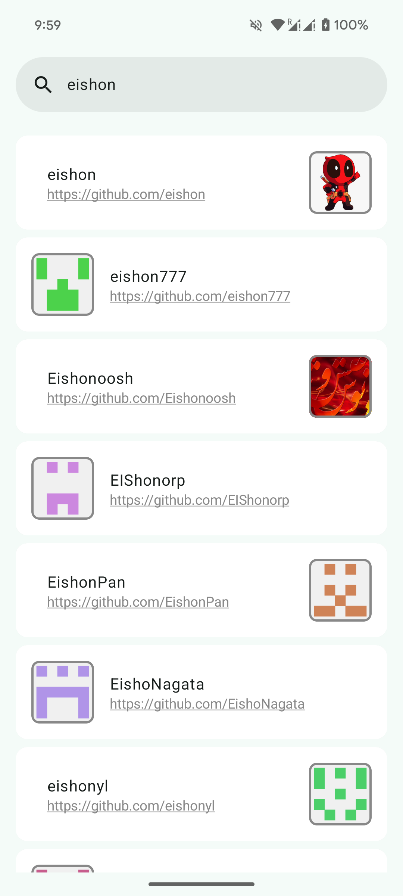

# github-sample
A simple GitHub App that load and Search GitHub users and check their profile.

## Screenshots
### Dark Mode
| 1 | 2 | 3 |
|:-----------:|:-------------:|:-------------:|
||||

### Light Mode
| 1 | 2 | 3 |
|:-----------:|:-------------:|:-------------:|
||||

## Features
- User List Screen
    - Can load GitHub users
    - Can search GitHub users
    - can check user username, avatar and profile link
    - Can check GitHub user profile on web view
- User Details Screen
    - Name
    - Avatar
    - Full Name
    - Company
    - Location
    - Profile Link. Can check GitHub user profile on web view from link
    - Bio
    - Followers, Following and Public Repositories count
    - Public Repositories
        - Name
        - Language
        - Description
        - Starred and Watchers count
        - Can check repositories on web view

## API Reference
- https://docs.github.com/en/rest/users/users
- https://api.github.com/

## Tech Stack
Android (Kotlin, Jetpack Compose)

## Main Libraries
- Application
    - Compose
    - ViewModel
    - Lifecycle
    - Coroutines
    - Flow
    - Moshi
    - Dagger-Hilt
    - Retrofit
    - OkHttp
    - Coil
    - Navigation Compose
- Test
    - JUnit
    - Mockito
    - Coroutines Test